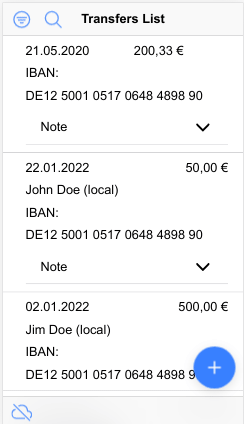

# Description
This app was developed as a part of BANKSapi Coding Challenge

## Install
1. Clone this repo
`git clone https://github.com/dalyonushkin/BANKSApi-coding-challenge-client.git`
or
`git clone git@github.com:dalyonushkin/BANKSApi-coding-challenge-client.git`
2. Change current folder to app
`cd BANKSApi-coding-challenge-client`
3. Install dependencies
`npm install`
4. Run app
`ionic serve`
5. You can reach app at `http://localhost:8100`

## Testing
Run unit test
`npm test`
You can found code coverage report at  `coverage/transer-app/index.html`
Run Cypress testing
`npm run cypress:run`

## Some issues, comments and todos that I did not have time to implement
- [ ] Todo:  move `ValidationMessages` to interface,
- [ ] Todo:  move all staff related to model to separete file,
- [ ] Todo: fix duplicate code at  `src/app/pipes/filter-transfer.pipe.ts`, need to use `UtilsService.filterTransfers`,
- [ ] Todo: move `UtilsService.filterTransfers` to model,
- [ ] Todo: add test for transform response from server,
- [ ] Todo: add handle errors to http responses,
- [ ] Todo: add CRUD operations to server,
- Page Design is not my master skill :(
- I'm unable to use property [isDateEnabled](https://ionicframework.com/docs/api/datetime#disabling-dates) of `ion-datetime` component. Looks like there are same [issue at GitHub](https://github.com/ionic-team/ionic-framework/issues/25189)
- FormBuilder auto-validation changes the class of the parent component, I couldn't find a way to reproduce the same behavior in the controller's code. I decided to develop the component to make it look the same.
- I've spent some time to resolve some differenet `ionic` versions issues (v3 vs v5) installed on the same computer. I'm using `npx`, but not `nvm`. Anyway, now ionic v6 is installed globally at my computer :)
- In my opinion, I don't show full usage of NgRX as you expected. There are only simple reducers, store and selector, but no effects at the moment. Probably you want to I implement http requests to server to CRUD operations and filters with NgRX, but I did it partially. Also, I have some issues with selector's typings. I wish to make this part better, but  I have no time for it :(. 
- I'm unable to use `jasmine` and `cypress` typing at the same time, now there are  `cypress`,
- There are some example of antipattern in template `src/app/home/home.page.html`. I've placed it there just for example how to avoid code coverage quality gate.
- Suppose that `J`  in date format `DD.MM.JJJJ` is for `year`,
- I was surprised about `eslint` default rule [`no-inferrable-types`](https://github.com/typescript-eslint/typescript-eslint/blob/v5.3.0/packages/eslint-plugin/docs/rules/no-inferrable-types.md),
- I liked the Cypress

# Demo
